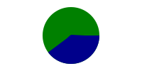
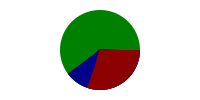

# Creating Pie Chart with Stroke-dasharray

## What is stroke-dasharray?
*Stroke-dasharray* is an attribute to draw dotted lines with custom style. It can include one or more values to define sizes of dashes and gaps.

### Examples
#### Stroke-dasharray in \<line\>
```xml
<!-- stroke-dasharray with one value -->
<svg style="background-color:lightgrey">
    <g transform="translate(20,20)" >   
    
            <line x1="0" y1="0" x2="100" y2="0" stroke="black" 
                  stroke-dasharray="8"/>
                  
    </g>
</svg>
```
Output:

  

If stroke-dasharray has only one value, the sizes of both dashes and gaps are the same, which are 8 here.

Since the size of the line is 100, and 100 is not divisible by 8, we can see that the last dash is partially displayed.

```xml
<!-- stroke-dasharray with two values -->
<line x1="0" y1="0" x2="100" y2="0" stroke="black" 
      stroke-dasharray="15 8"/>                 
```
Output:

 
If stroke-dasharray have two values, then the first one(15) is for size of dashes, while the second one(8) is for that of gaps. 

Still, the part beyond the size of the line will be hidden.

#### Stroke-dasharray in \<circle\>
```xml
   <circle cx="50" cy="50" r="20" stroke="black" stroke-width="3"
           fill="none "stroke-dasharray="15 8"/>
```
Output:

 

Stroke-dasharray in circle is similar with that in line. The size of dashes is 15, while that of gaps is 8. The length of the stroke is circumference of circle. The part of dashes or gaps beyond circumference also will be hidden. We can see that two dashes look like connected together. 

## How to draw a pie chart with stroke-dasharray?
### Start with drawing a slice of pie chart
Before solving this problem, we can try to imagine that if a stroke-dasharray attribute with two values has an extremely large sized gap, what would happen?
```
<!-- 9999999 means a very high value here. -->
<circle cx="50" cy="50" r="20" stroke="black" stroke-width="3" 
        fill="none" stroke-dasharray="15 9999999"/>
        
```
Output:

 

We can only get one dash, because the size of gaps is so large that other dashes are hidden.
In fact, we do not need an extremely large sized gap. 
When the size of gaps is greater or equals to the circumference of the circle, any other dash can be hidden.

Then, try to increase the width of the stroke. When the width of the stroke is large enough, like twice the radius, we can get a slice. 

 

The dark grey part in the image above is the stroke with stroke-width 3, while the black part is with stroke-width 40. 

We can see that stroke-width expands both inside and outside of the stroke. This is why we need the stroke-width with twice the radius to get a slice.

### How to control the percentage of a slice?
We need two formulas:

- slice = percent * whole

- whole(circle circumference)  = 2 \* pi \* $r

Set the size of dashes as value *slice*, and set the size of gaps as value *whole*.

So, we can get:

stroke-dasharray="slice, whole"

stroke-dasharray="2 \* pi \* \$r \* $percent , 2 \* pi \* \$r"

```xml
<!-- draw a 25% slice -->
<!-- 
     radius = 20
     slice = 2*pi*20*25% = 31.416 
     whole = 2*pi*20 = 125.664
-->
<circle cx="50" cy="50" r="20" stroke="black" stroke-width="40" 
        fill="none" stroke-dasharray="31.416 125.664"/>
        
```
Output:

 

### How to draw the whole pie chart?
This is the data for our pie chart.

| objects     |percentage(%)| color|
| :---------- | :---------: | :---:|
| A           | 30          | red  |
| B           | 10          | blue |
| C           | 60          | green|

Firstly, we need to draw a complete circle.
```xml
<!-- 
     radius = 20        
     Slice:
        A% + B% + C% = 100%
        2*pi*20*100% = 125.664 
     Whole:
        2*pi*20 = 125.664
-->
<circle cx="50" cy="50" r="20" stroke="green" stroke-width="40" 
        fill="none" stroke-dasharray="125.664, 125.664"/>
        
```
Output:

 

Next, we draw a slice with percentage of sum of A% and B%.
```xml
<!-- 
     radius = 20
     Slice:
        A% + B% = 40%
        2*pi*20*40% = 50.265 
     Whole:
        2*pi*20 = 125.664
-->
<circle cx="50" cy="50" r="20" stroke="darkblue" stroke-width="40" 
        fill="none" stroke-dasharray="50.265, 125.664"/>
        
```
Output:

 

Since the code is executed line by line, the later slices can cover previous slices. In the image above, the blue slice covers the green one, and now the green one shows the percentage of object C, which is 60%.

Finally, we draw a slice with percentage of A%.
```xml
<!-- 
     radius = 20
     Slice:
        A%= 30%
        2*pi*20*30% = 37.699 
     Whole:
        2*pi*20 = 125.664
-->
<circle cx="50" cy="50" r="20" stroke="darkred" stroke-width="40" 		  fill="none" stroke-dasharray="37.699, 125.664"/>

        
```
Output:

 

In the final step, the red slice covers the blue one. Blue slice is 10% now, while red slice is 30%. Thus, we get a whole pie chart.

### In XSLT

In XSLT, we can use math functions, so we are allow to throw away our calculator.
```xml
xmlns:math="http://www.w3.org/2005/xpath-functions/math"
    exclude-result-prefixes="xs math"
```
Add this code to xslt element, so that we can work with math:pi().
```xml
    <xsl:variable name="radius" select="20"
    <!-- math:pi() returns the value of pi-->    
    <xsl:variable name="circumf" select="2 * math:pi() * $radius"/>
    
```

```xml
<!-- This is an example to draw a pie chart in XSLT -->
<xsl:variable name="colorPercent" select="$color div $total"/>
<xsl:variable name="naturePercent" select="$nature div $total"/>
<xsl:variable name="shapePercent" select="$shape div $total"/>
<xsl:variable name="techPercent" select="$tech div $total"/>

<xsl:variable name="circumf" select="2 * math:pi() * $radius"/>

<circle fill="none" cx="0" cy="0" r="{$radius}" 
        stroke-width="{$radius * 2}" stroke-dasharray="{$circumf * ($techPercent  + $colorPercent  +  $naturePercent  + $shapePercent), $circumf}" stroke="palegreen"/>
                
<circle fill="none" cx="0" cy="0" r="{$radius}" stroke-width="{$radius * 2}"
        stroke-dasharray="{$circumf *  ($techPercent + $colorPercent + $naturePercent), $circumf}" stroke="lightblue"/>
                
<circle fill="none" cx="0" cy="0" r="{$radius}" stroke-width="{$radius * 2}" 
        stroke-dasharray="{$circumf * ($techPercent + $colorPercent), $circumf}" stroke="blanchedalmond"/>
                
<circle fill="none" cx="0" cy="0" r="{$radius}" stroke-width="{$radius * 2}" 
        stroke-dasharray="{$circumf * $techPercent, $circumf}" stroke="pink"/>
```

[Link to the sample xslt file](KewG_pieChart.xsl)

