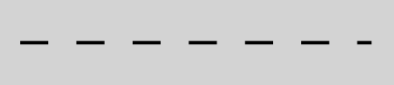
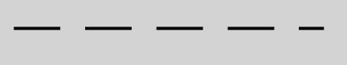
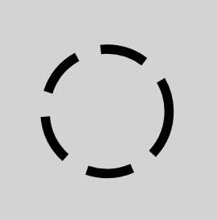
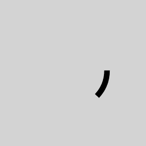
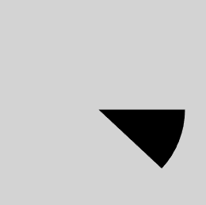
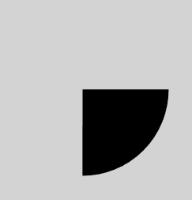
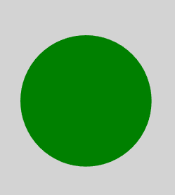
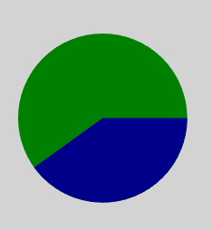
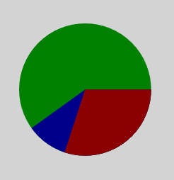

# Creating pie chart with Stroke-dasharray

## What is stroke-dasharray
*Stroke-dasharray* is an attribute to draw dotted lines with custom style. It can includes one or more values to define sizes of dashes and gaps.

### Examples
#### Stroke-dasharray in \<line\>
```
<!-- stroke-dasharray with one value -->
<svg style="background-color:lightgrey">
    <g transform="translate(20,20)" >   
    
            <line x1="0" y1="0" x2="100" y2="0" stroke="black" 
                  stroke-dasharray="8"/>
                  
    </g>
</svg>
```
Output:

  

If stroke-dasharray has only one value, the sizes of both dashes and gaps are the same, which are 8 here.
  
Since the size of the line is 100, and 100 is not divisible by 8, we can see that the last dash is partially displayed.
  
```
<!-- stroke-dasharray with two values -->
            <line x1="0" y1="0" x2="100" y2="0" stroke="black" 
                  stroke-dasharray="15 8"/>                 
```
Output:


    
If stroke-dasharray have two values, then the first one(15) is for size of dashes, while the second one(8) is for that of gaps. 

Still, the part beyond the size of the line will be hidden.

#### Stroke-dasharray in \<circle\>
```
   <circle cx="50" cy="50" r="20" stroke="black" stroke-width="3"
           fill="none "stroke-dasharray="15 8"/>
```
Output:



Stroke-dasharray in circle is similar with that in line. The size of dashes is 15, while that of gaps is 8. The length of the stroke is circumference of circle. The part of dashes or gaps beyond circumference also will be hidden. We can see that two dashes look like connected together. 

## How to draw a pie chart with stroke-dasharray?
### Start with drawing a slice of pie chart
Before solving this problem, we can try to imagine that if a stroke-dasharray attribute with two values has an infinite size of gaps, what would happen?
```
<circle cx="50" cy="50" r="20" stroke="black" stroke-width="3" 
        fill="none" stroke-dasharray="15 9999999"/>
        <!-- 9999999 means an infinite value here. -->
```
Output:



We can only get one dash, because the size of gaps is so large that other dashes are hidden.
In fact, we do not need an infinite size of gaps. 
When the size of gaps is greater or equals to the circumference of the circle, any other dash can be hidden.

Then, try to increase the width of the stroke. When the width of the stroke is large enough, like twice the radius, we can get a slice.



### How to control the percentage of a slice?
We need two formulas:

- slice = percent * whole

- whole(circle circumference)  = 2$\pi$r

Set the size of dashes as value *slice*, and set the size of gaps as value *whole*.

So, we can get:

stroke-dasharray="slice, whole"

stroke-dasharray="2$\pi$r * *percent* , 2$\pi$ r"

```
<!-- draw a 25% slice -->
<circle cx="50" cy="50" r="20" stroke="black" stroke-width="40" 
        fill="none" stroke-dasharray="31.416 125.664"/>
        <!-- 
             radius = 20
             slice = 2*pi*20*25% = 31.416 
             whole = 2*pi*20 = 125.664
        -->
```
Output:



### How to draw the whole pie chart?
This is the data for our pie chart.

| objects     |percentage(%)| color|
| :---------- | :---------: | :---:|
| A           | 30          | red  |
| B           | 10          | blue |
| C           | 60          | green|

Firstly, we need to draw a complete circle.
```
<circle cx="50" cy="50" r="20" stroke="green" stroke-width="40" 
        fill="none" stroke-dasharray="125.664, 125.664"/>
        <!-- 
             radius = 20        
             Slice:
                A% + B% + C% = 100%
                2*pi*20*100% = 125.664 
             Whole:
                2*pi*20 = 125.664
        -->
```
Output:



Next, we draw a slice with percentage of sum of A% and B%.
```
<circle cx="50" cy="50" r="20" stroke="blue" stroke-width="40" 
        fill="none" stroke-dasharray="50.265, 125.664"/>
        <!-- 
             radius = 20
             Slice:
                A% + B% = 40%
                2*pi*20*40% = 50.265 
             Whole:
                2*pi*20 = 125.664
        -->
```
Output:



Since the code is executed line by line, the later slices can cover previous slices. In the image above, the blue slice covers the green one, and now the green one shows the percentage of object C, which is 60%.

Finally, we draw a slice with percantage of A%.
```
<circle cx="50" cy="50" r="20" stroke="darkpink" stroke-width="40" 
        fill="none" stroke-dasharray="37.699, 125.664"/>
        <!-- 
             radius = 20
             Slice:
                A%= 30%
                2*pi*20*30% = 37.699 
             Whole:
                2*pi*20 = 125.664
        -->
```
Output:



In the final step, the red slice covers the blue one. Blue slice is 10% now, while red slice is 30%. Thus, we get a whole pie chart.

### 