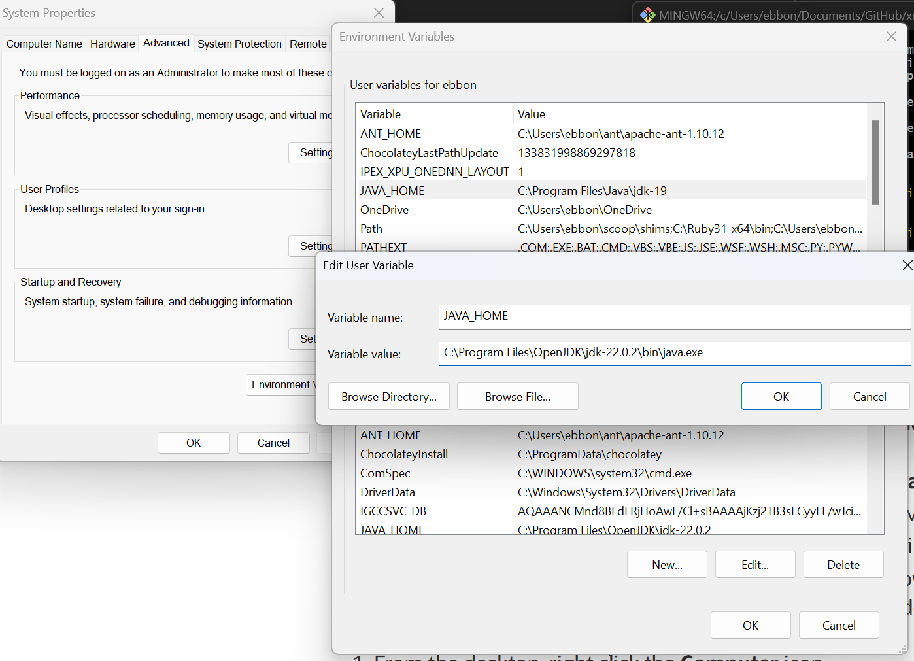

# Invisible XML (ixml) / XProc Installations (for Windows)


This document is a detailed set of installation/configuration instructions for Windows users, developed from
<http://dh.obdurodon.org/ixml-and-xproc-configuration.xhtml>.

This is related to a tutorial under development at <http://dh.obdurodon.org/ixml-and-xproc-lesson-plan.xhtml>. 

This is cool coffee art:


               _ 
             \| |D         
      C{_}    |_|     
    
       mug   coffee 
              pot     


*********************

# Table of Contents

* [**Preliminary Installations & Suggestions**](#preliminary-installations--suggestions)
	* [Installing Chocolatey](#installing-chocolatey)
	* [Installing JDK](#installing-jdk)
	* [Suggestions](#suggestions)
* [**XProc Processors**](#xproc-processors)
	* [**Calabash**](#calabash)
		* [Installing Calabash](#installing-calabash)
		* [Graphviz](#graphviz)
		* [CoffeeSacks](#coffeesacks)
		* [Configuring Calabash](#configuring-calabash)
		* [Creating an Alias for Calabash](#creating-an-alias-for-calabash)
		* [Testing Calabash](#testing-calabash)
	* [**Morgana**](#morgana)
* [**Invisible XML (ixml) Processors**](#invisible-xml-ixml-processors)
	* [**CoffeePot**](#coffeepot)
	* [**Markup Blitz**](#markup-blitz)
* [**Completion**](#completion)

*********************

# Preliminary Installations & Suggestions

On Windows, you will need to move between different shells to handle installations. You will get to know:

* Windows Power Shell, Run in Administrator mode

* Git Bash Shell (where you use git commands / interface with GitHub)

You will also need to: 

* have a `.bashrc` file for storing aliases. An alias is a short word / phrase you can type in your shell to stand in for longer commands, and it will make it easy to run the programs we're installing.

* find and edit your system PATH variables. Some of this can be done in your Control Panel. 

### Installing Chocolatey

First, install the chocolatey package manager for Windows. This will help you to install packages at the command line.

* Use your Windows PowerShell in "Run as Administrator" mode, and follow [Chocolatey's installation instructions](https://chocolatey.org/install)).

* You can quickly test out your new installation of Chocolatey by installing Marktext, popular free markdown editor for Windows (which I'm using to write up this guide). Try the command `choco install marktext` You should see the new software come up in your taskbar and you can try it out!

### Installing JDK

First, make sure you have developer (jdk) java installed:

* To check if you have java, you can use your Git Bash shell to enter `which java` or `where java`(Those commands won't work in PowerShell, but all the shells will respond to `java -version` (which tells you if you have an old version or nothing at all.)
  * Dr. B here: My version was Java 19 (from 2022) on my Lenovo laptop. For the invisible XML / XProc work we're doing here, I'm going ahead and installing the latest easily available OpenJDK developer version for Windows.
* Most likely, you'll need to install OpenJDK java. We'll use chocolatey to install it. Open your PowerShell (running as Administrator) and enter:

	```shell
	choco install openjdk
	```

  (When doing all these shell installations be sure you read the responses and enter "Y" as needed to continue processes.)

* Now when you check your version of java:
* 
	```shell
	java -version
	```

	You should see the current JDK that you installed with chocolatey.

* Next we need to make sure the location of the JDK you installed is set in your system environment variables. In your Search bar, look for "System" or "Control Panel" (or Edit the System Environment Variables). Find the tab to edit the Environment Variables and look for JAVA_HOME. Click "Edit User Variable" and paste in the new filepath of your Java. (Find that in Git Bash with `where java`)
  
  
  
### Suggestions

* There are a lot of installations throughout this process. To keep them organized, *it is a good idea to place them all in your GitHub directory since you should be familiar with that directory at this point.*

* To make things simpler for yourself, use the same alias names that I use in this tutorial, so when we're working on this in class, there's no confusion if your alias has a different name than mine.

*********************

# XProc Processors

## Calabash

This is an XProc processor that you can use with the ixml processor [**CoffeePot**](#coffeepot) that's good for simple grammars and input files that aren't super large.

### Installing Calabash
  
* Get it from here: <https://github.com/xmlcalabash/xmlcalabash3/releases> and look for the **xmlcalabash zip file** in the latest release, after the release notes. The zip directory you need is the third one from the top (named something like this with the version number in the name): **xmlcalabash-3.0.0-alpha18.zip**
* Unzip this and move it somewhere central where it's easy to work with. I set my unzipped xmlcalabash folder in my GitHub directory so it's near where I work on code.
* Open your shell and navigate to your new xmlcalabash folder. For this to work we need to be able to use Java to execute the .jar file inside.
       Test if your Java installation works. This 'help' shell command will show you all the different commands available **(ADAPT THIS LINE TO APPLY TO YOUR VERSION NUMBER AS NEEDED!)**:
	
	```shell
	java -jar xmlcalabash-app-3.0.0-alpha18.jar help
	```
	
	* NOTE: on the XML Calabash repo, they left out the `.jar` portion of the filename, so their line won't work
	* NOTE: **alpha18 is the latest release as of 2 February 2025**
  
### Graphviz

* **Test if you have graphviz** by entering this in your terminal: 

	```shell
	dot -V
	```
	
* You will probably need to install GraphViz, and you can do that with `choco install graphviz`.

### CoffeeSacks

*(This is needed for Calabash)*
  
  * Pick up CoffeeSacks from the versioned releases on the repo, here: https://github.com/nineml/coffeesacks/releases and find the latest one to download.
  * Copy the **CoffeeSacks jar** file into your XML Calabash `extra/` subdirectory.

### Configuring Calabash

***Making the .xmlcalabash3 dot-file:***
 
* Navigate to your "home" directory (which is where you set up your .bash_profile file and establish your aliases and environment variables and such like). In this location we'll be storing a dot-file which will help Calabash to run.
    * NOTE: We will NOT be using Saxon EE at all.
    * We need to know where Chocolatey installed graphviz.
    * Use the Git Bash shell and type `where dot` . Mine is given as `C:\Program Files\Graphviz\bin\dot.exe` You will need this path.
* Back in your "home" directory, make the new file. You can copy in this command in your Git Bash terminal (with that leading dot exactly like this):

	```shell
	touch .xmlcalabash3
	```
	
* Open up the file in `nano` to edit: 

	```shell
	nano .xmlcalabash3
	```
	
* Here's what you'll need inside (copy/paste):


    * *You will need to edit the `@dot` attribute on the `<cc:graphviz>` element to point it to YOUR location for graphviz up to the dot.exe*
  
   ```shell
      <cc:xml-calabash xmlns:cc="https://xmlcalabash.com/ns/configuration">
         <cc:graphviz dot="C:\Program Files\Graphviz\bin\dot.exe"/>
      </cc:xml-calabash>
   ```

### Creating an Alias for Calabash
This alias will execute a pretty long command, so you'll definitely want to use it instead of typing the whole command each time.

* Open up your `.bashrc` in your Git Bash terminal:

	```shell
	nano .bashrc
	```

    * You need the filepath of where you installed Calabash (I put mine in my GitHub directory). You'll be pointing your script to the `xmlcalabash.sh` file inside.

    * Here's what my calabash execution alias looks like in my `.zshrc` file, giving it the name "calabash"

	```shell
	alias calabash='~/Documents/GitHub/xmlcalabash-3.0.0-alpha18/xmlcalabash.sh --init:org.nineml.coffeesacks.RegisterCoffeeSacks'
	```
	
   * NOTE: If you're copying this line and just changing the username to match your own, make sure you also check that the name of the calabash directory is the same (version name) as yours.

### Testing Calabash

* To "smoke test" (or see if your installation is working) navigate to your xmlcalabash repo and enter this command: `calabash helloWorld.xpl`. If your installation was successful you should see the following:

	```shell
	  === result :: 1 :: file:/C:/Users/ebbon/Documents/GitHub/xmlcalabash-3.0.0-alpha18/helloWorld.xpl ===
	<?xml version="1.0" encoding="windows-1252"?>
	<helloWorld>This is XML Calabash version 3.0.0-alpha18.
	Share and enjoy!</helloWorld>
	=====================================================================================================
	```

* *For future reference*: As soon as we have our own XProc pipeline files (`.xpl`) ready to run, we'll be running with a command like this, using the alias you created: `calabash filename.xpl` ). And we can see some nifty graphviz sketches of our pipeline if we append this to the command (including the dot at the end: `--graphs:.` like so: `calabash filename.xpl --graphs:.`


## Morgana

This is an XProc processor that you can use with more complex ixml contexts and for processing lots of input. It works with the ixml processor [**Markup Blitz**](#markup-blitz).

* Official documentation: <https://www.xml-project.com/manual/index.html>

* Download MorganaXProc-IIIse from [Sourceforge](https://sourceforge.net/projects/morganaxproc-iiise/) and unzip the folder. I'm extracting this to my GitHub folder so it's near my projects.

* Now we're going to install [SchXslt](https://git.sr.ht/~dmaus/schxslt2) (which is pronounced "Shicksilt"!) This is an XSLT-based Schematron processor that can handle Schematron validation.
  
  * On this sourcehut page, find the installation in the top center under "refs", and follow the link to "release notes" (As of 2 February 2025, the current SchXslt2 release is <https://git.sr.ht/~dmaus/schxslt2/refs/v1.3.1>) I also unzipped this to my GitHub directory. 

* Okay, for this next part, navigate to your "home" directory (where your `.bashrc` lives, and we'll set up a `morgana-config.xml` configuration file there. For this configuration you're going to need to have some inforamtion ready:
  
  * You'll need the path to the SchXSLT transpile.xsl file: You'll find that in the main directory of the schxslt directory you just saved. (Mine is here: `/Users/ebbon/Documents/GitHub/schxslt2-1.3.1/transpile.xsl`
  
  * You'll need the path to a Saxon processor that can run XSLT and XQuery and such. You have this already if you installed Calabash: Saxon-HE comes in its library or "lib" folder: 
    Find/copy the path to the Saxon_HE jar file in your xml-calabash lib. (Here's mine:  `/Users/ebbon/Documents/GitHub/xmlcalabash-3.0.0-alpha18/lib/Saxon-HE-12.5.jar`)
  
  * We presume you're going to be installing [Markup Blitz](#markup-blitz) for your ixml processor (so our configuration settings for Morgana will be set to Markup Blitz.)
  
  * In your "home", make the configuration file with `touch morgana-config.xml`
  
  * `nano morgana-config.xml`, paste in the following, and **adapt it** so you:
    
    * Change the `<path_to_SchXSLT2_transpiler>` element contents to your path to the transpile.xsl file in schxslt directory. 
    * Change the `<xslt-config>` element contents to your path to Saxon-HE.
    * One more thing: notice the contents of the `<ixml-connector>` element. That's not a filepath, but it is an indicator of which ixml processor you're using. Our active setting in the code below is for Markup Blitz, but you can set this to CoffeePot instead. (We think you can set it to CoffeePot by using the NineMLConnector version that is commented out above it, but we should check the documentation to be sure). 
    
    ```xml
    <morgana-config xmlns="http://www.xml-project.com/morganaxproc">
    <!-- Relative paths are resolved by uri of this file -->
    
        <path_to_SchXSLT2_transpiler>/Users/ebbon/Documents/GitHub/schxslt2-1.3.1/transpile.xsl</path_to_SchXSLT2_transpiler>
    
        <XSLTValidationMode>LAX</XSLTValidationMode>
    
        <xslt-connector>Saxon12-3</xslt-connector>
        <xquery-connector>Saxon12-3</xquery-connector>
        <schematron-connector>schxslt2</schematron-connector>
    
        <xslt-config>/Users/ebbon/Documents/GitHub/xmlcalabash-3.0.0-alpha18/lib/Saxon-HE-12.5.jar</xslt-config>
        <xslt-config></xslt-config>
          <silent>true</silent>
    
    <!--
    <fo-connector>com.xml_project.morganaxproc3.fop2x.ApacheFOP2xConnector</fo-connector>
    <fo-connector>com.xml_project.fosupport.AHFormatterV65.AHF65Connector</fo-connector>
    -->
    
    <!-- <ixml-connector>com.xml_project.morganaxproc3.ninemlConnector.NineMLConnector</ixml-connector> -->`
    <ixml-connector>com.xml_project.morganaxproc3.markupblitzConnector.MarkupBlitzConnector</ixml-connector>
    
    <!--
    <mediatype-mapping>
        <map file-extension="123" media-type="application/xml" />
    </mediatype-mapping>
    -->
    </morgana-config>
    ```

* **Morgana alias**: Okay, now it's time to make an alias for Morgana! Open your `.bashrc` file. You will need to adapt my sample alias below to repreesent the location of 
  
  * the location of your Morgana.sh file in the Morgana directory (I put mine over in my "GitHub" folder). 
  
  * the location of your morgana-config.xml file (in your "home").
  
  * My morgana alias looks like this:
    
    ```shell
    alias morgana='~/Documents/GitHub/MorganaXProc-IIIse-1.4.10/Morgana.bat -config=/Users/eeb4/morgana-config.xml'
    ```

* Time for some coffee! We'll go and download and install CoffeeFilter and CoffeeGrinder from <https://github.com/nineml>. (As usual I'm setting coffee stuff in my GitHub folder.)
  
  * Download [the most recent CoffeeFilter](https://github.com/nineml/coffeefilter/releases), unzip it where you want it. 
  * Download [the most recent CoffeeGrinder](https://github.com/nineml/coffeegrinder/releases), unzip it where you want it.

* **Modifying Morgana.bat**: Now we need to make sure Morgana's Windows batch executable script (the Morgana.bat file) can find its way to the CoffeeGrinder and CoffeeFilter jar files you just unpacked.
  
  * Open the Morgana.bat file in your nano or vi editor.
    * You'll need to add and adjust the lines marked `REM Local customization`** to identify the location of Saxon-HE (we'll use the one in Calabash library), the CoffeeGrinder and CoffeeFilter .jar files, and finally the location of the Markup Blitz .jar file (after you install [Markup Blitz](#markup-blitz)).
    * **Edit the `CLASSPATH`** near the end of the file: Basically you need to add all the local customization variables here, and it will be kind of like pouring Markup Blitz through a coffee grinder, into a coffee filter, and then through some saxon into a morgana mug. :-) Here's how the CLASSPATH should be edited, and you just need to make sure that each of these variables has been defined in order for Morgana to run.
      `set CLASSPATH="%BLITZ_JAR%;%COFFEEGRINDER_JAR%;%COFFEEFILTER_JAR%;%SAXON_JAR%;%LIB_PATH%;%PROG_PATH%"`
    * Here is how my Morgana.bat looks after I've located (and installed) everything:

```shell
@echo off
setlocal

set MORGANADIR=%~dp0

REM All related jars are expected to be in $MORGANA_LIB. For externals jars: Add them to $CLASSPATH
set PROG_PATH="%MORGANADIR%MorganaXProc-IIIse.jar"
set LIB_PATH="%MORGANADIR%MorganaXProc-IIIse_lib/*"

REM Local customization
set SAXON_JAR="/c/Users/ebbon/Documents/GitHub/xmlcalabash-3.0.0-alpha18/lib/Saxon-HE-12.5.jar"
set COFFEEGRINDER_JAR="/c/Users/ebbon/Documents/GitHub/coffeegrinder-3.2.7/CoffeeGrinder-3.2.7.jar"
set COFFEEFILTER_JAR="/c/Users/ebbon/Documents/GitHub/coffeefilter-3.2.7/CoffeeFilter-3.2.7.jar"
set BLITZ_JAR="/c/Users/ebbon/Documents/GitHub/markup-blitz/build/libs/markup-blitz.jar"


set CLASSPATH="%BLITZ_JAR%;%COFFEEGRINDER_JAR%;%COFFEEFILTER_JAR%;%SAXON_JAR%;%LIB_PATH%;%PROG_PATH%"

REM Settings for JAVA_AGENT: Only for Java 8 we have to use -javaagent.
@for /f tokens^=2-5^ delims^=.-_^" %%j in ('java -fullversion 2^>^&1') do set "JAVA_VERSION=%%j%%k"

set JAVA_AGENT=
if %JAVA_VERSION% EQU 18 (set JAVA_AGENT="-javaagent:%MORGANADIR%MorganaXProc-IIIse_lib/quasar-core-0.7.9.jar")

java %JAVA_AGENT% -cp %CLASSPATH% com.xml_project.morganaxproc3.XProcEngine %*

```

* To "smoke test" Morgana to see if it is properly installed, navigate to your Morgana repo and enter `morgana pipeline.xpl`. If your installation was successful, you will see the following:

```shell
$ morgana pipeline.xpl
Hello world. This is an XProc 3.0 pipeline running.
```

*********************

# Invisible XML (ixml) Processors

## CoffeePot

To be used with the XProc processor [**Calabash**](#calabash)
You may think you installed this already, but that was "CoffeeSacks" (made by the same NineML developers) which we needed for Calabash to run, and we'll see a running theme on "coffee" related installations in our XProc and ixml setup. :-) 

* Here's the [CoffeePot](https://github.com/nineml/coffeepot) repo, and here's where to [download the latest release](https://github.com/nineml/coffeepot/releases).

* I'm storing CoffeePot in my GitHub directory on my local computer.

* We need to **create an alias for the coffeepot .jar file in your `.bashrc` file**. Note the filepath that leads to the coffeepot jar  (use `pwd` to help), and your alias might look something like mine (make sure yours applies the version number that you downloaded:
  
  ```
  alias coffeepot='java -jar /Users/ebbon/Documents/GitHub/coffeepot-3.2.7/coffeepot-3.2.7.jar'
  ```

*  To do things with CoffeePot, we need to create a system dot-file named `nineml.properties` in the same "home" location as your `bashrc`. This contains some default settings for pretty-printing your output XML and your graphviz visualizations. You'll need to note (again) where your GraphViz bin/dot is located, and you've entered that already in your `.xmlcalabash3` file, so use the same filepath location here.


  * In your "home" (same place where you open `.bashrc`) create a new system file and open it for editing with `nano .nineml.properties`
    
    * Edit your file to adapt the following (using your own filepath to graphviz that you copied from `.xmlcalabash3`). Examples:
      
         ```
          graphviz=/Program Files/Graphviz/bin/dot.exe
          ignore-trailing-whitespace=true
          pretty-print=true
          progress-bar=tty
          assert-valid-xml-characters=true
          assert-valid-xml-names=true
          ignore-bom=true
          normalize-line-endings=true
          trailing-newline-on-output=true   
      ```
      
      * If you ever need to adjust these settings or find out more, here's [the CoffeePot documentation](https://docs.nineml.org/current/coffeepot/bk02ch07.html).
        
        
        ### Running CoffeePot
        
        Run CoffeePot over an ixml grammar and a .txt file like this, using your alias: (Think of "g" as standing for "grammar" and "i" as "input file")

```shell
coffeepot -g:filename.ixml -i:filename.txt
```


* You can add a couple of things to this command to check for ambiguities in the ixml, and to visualize the output:
  
  * Try adding `--analyze-ambiguity` like so: `coffeepot -g:filename.ixml -i:filename.txt --analyze-ambiguity`
  
  * Try adding `--graph:filename.svg` to get some SVG output, like so: `coffeepot -g:filename.ixml -i:filename.txt --graph:filename.svg` * NOTE: The SVG option is meant for simple/small things. CoffeePot won't be able to generate the SVG if it's going to be a large and complicated file.
    
    
## Markup Blitz

To be used with the XProc processor [**Morgana**](#morgana). Up to this point, we have been unpacking a lot of jar (java archive) files. This time, we're actually going to *build* the jar for Markup Blitz in order to install it.

- For this, we'll follow the [official Markup Blitz instructions (on the README)](https://github.com/GuntherRademacher/markup-blitz).
- (I cloned the markup-blitz repo in my GitHub directory.)
- For Macs, this line (marked for Linux/Unix) works to build our jar: `./gradlew clean jar`
- When Gradle finishes building you'll be returned to the command prompt. Check for the new jar, which you should now find in the repo in `build/libs/markup-blitz.jar`
- Finally, go to "home" to your `.bashrc` and make an alias for running your new markup-blitz.jar file. I called my alias "blitz" and my alias definition looks like this:

```shell
 alias blitz='java -jar /Users/ebbon/Documents/GitHub/markup-blitz/build/libs/markup-blitz.jar'
```


* To run Markup Blitz to process an ixml grammar and an input .txt file, use your new alias like this:

```shell
  blitz filename.ixml filename.txt
```

********************

# Completion

When you have finished all these installations, congratulations! You have everything you need (with Coffee Pot and Markup Blitz) to apply invisible xml to convert text files to xml according to your grammar definition. And you have everything you need (with Calabash and Morgana) to set that ixml conversion into a processing pipeline that can apply XSLT, XQuery, and Schematron to the XML that you create with ixml! 


```          .
                      `:.
                        `:.
                .:'     ,::
               .:'      ;:'
               ::      ;:'
                :    .:'
                 `.  :.
        _________________________
       : _ _ _ _ _ _ _ _ _ _ _ _ :
   ,---:".".".".".".".".".".".".":
  : ,'"`::.:.:.:.:.:.:.:.:.:.:.::'
  `.`.  `:-===-===-===-===-===-:'
    `.`-._:                   :
      `-.__`.               ,'
  ,--------`"`-------------'--------.
   `"--.__                   __.--"'
          `""-------------""'
```

*ASCII art credits: <https://ascii.co.uk/art/cup>*

