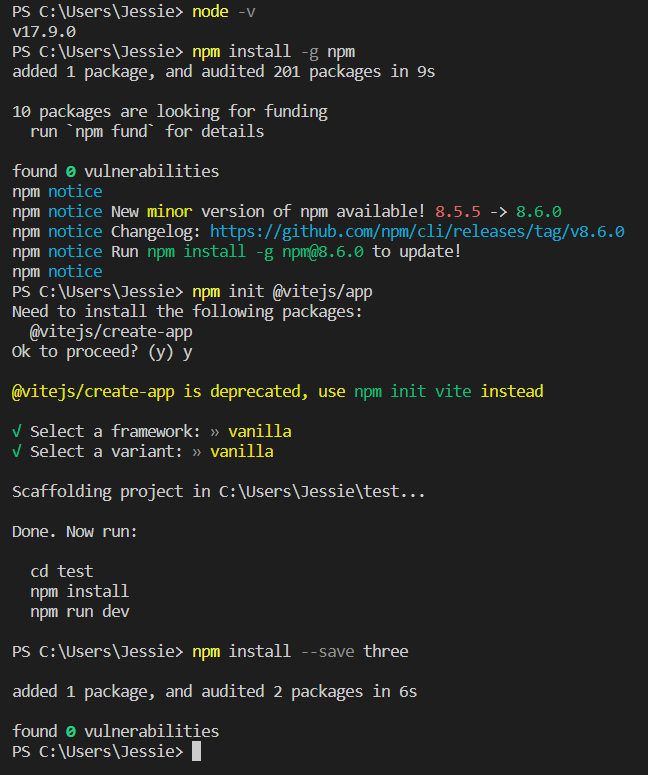

# Review for Mia's Three.JS tutorial

## Install package module

Here I made a mistake. I did not run ```cd test``` before running ```npm install --save three```. I hope you will remind readers to run it before install in the tutorial.

 

## HOW TO VIEW YOUR SITE LOCALLY

In the last step **Write your HTML**, I have created html file and css files for my website. In this step, I run ```npm run dev``` and jump to the localhost link. However, it's not my webpage, but the start page of Vite.

 

After asking for a help for Mia, I learn that after running ```npm run dev```, Vite generates a project folder with a start website for me, so I need to replace the code in these files.

 

Here, I suggest you inverse the steps of **Write your HTML** and **HOW TO VIEW YOUR SITE LOCALLY**. Thus, it will be clearer.

## Javascript Time!

I stop in the step of **Light and Material Types** and try to run my site, but the site did not show my 3D objects successfully. I try to move to the next step **Animate your scene**. After I adding animate function into my code, Three.JS worked well, and I get the 3D objects with animation. 

I found it worked well because there is the code ```renderer.render( scene, camera );``` in the animation function. In the step of **Scene Setup**, I have added render for scene and camera. It seems that I add the render too early. If I add render before adding cubes and camera, both cubes and camera could not be rendered successfully. Since I just copy the code according to the steps in the tutorial, I got this error of rendering.

Therefore, I suggest you remind readers to add ```renderer.render( scene, camera );``` after all objects added.

### Orbit Controls

Your mention that to click and drag can orbit the camera view, but I hope you can introduce how to navigate the 3D space instead of only to orbit it.

* Orbit - left-click and drag
* Zoom - rotate the wheel
* Pan - right-click and drag

The rest steps are very clear. 

 

## Suggestions

* **Install package module**
  * Run ```cd project_name``` before install modules like ```npm install --save three```.
  * After install all modules we need (there is only one in this tutorial), running ```npm run dev```.
  * We do not need to run ```npm run dev``` again after making changes, because page can reload automatically.
* **HOW TO VIEW YOUR SITE LOCALLY**
  * Put the step of **Write your HTML** after **HOW TO VIEW YOUR SITE LOCALLY**, because after running ```npm run dev```, Vite generates a project folder with default html file, css file, js file, and so on. We should  write code in the files generated by Vite.

* **Javascript Time!**
  * code ```renderer.render( scene, camera );``` after all objects added.
  * introduce how to navigate the 3D space instead of only how to orbit it:
    * Orbit - left-click and drag
    * Zoom - rotate or drag the wheel
    * Pan - right-click and drag

