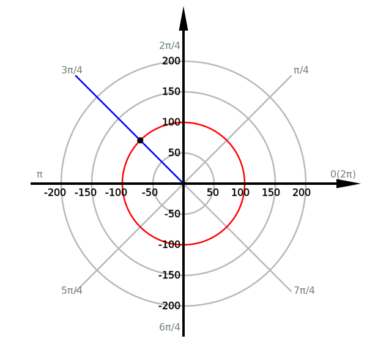
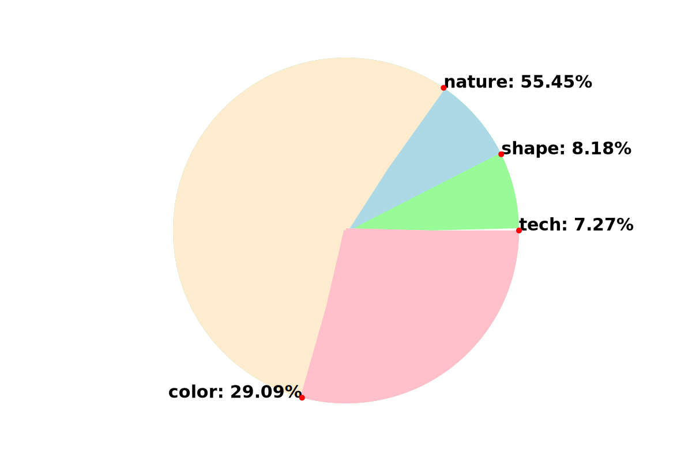
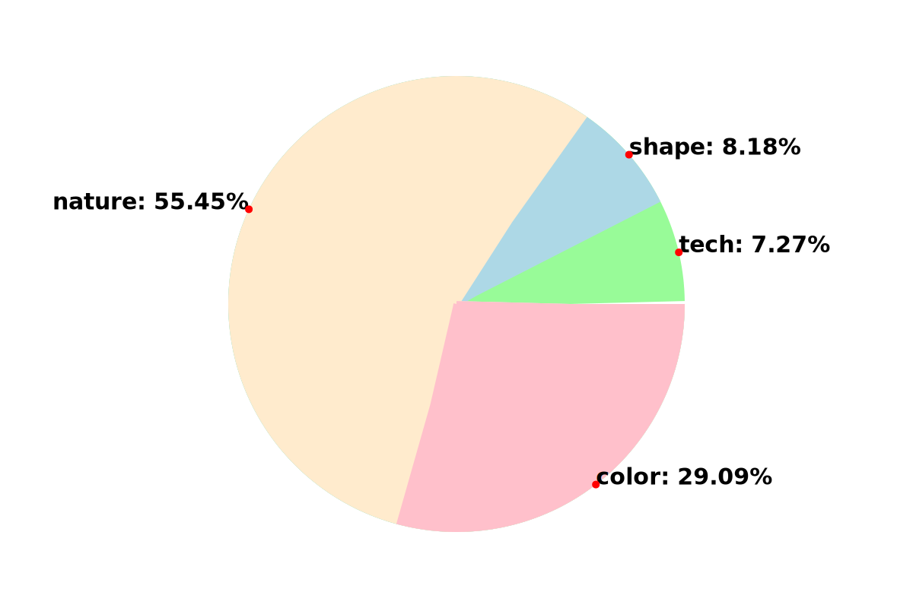
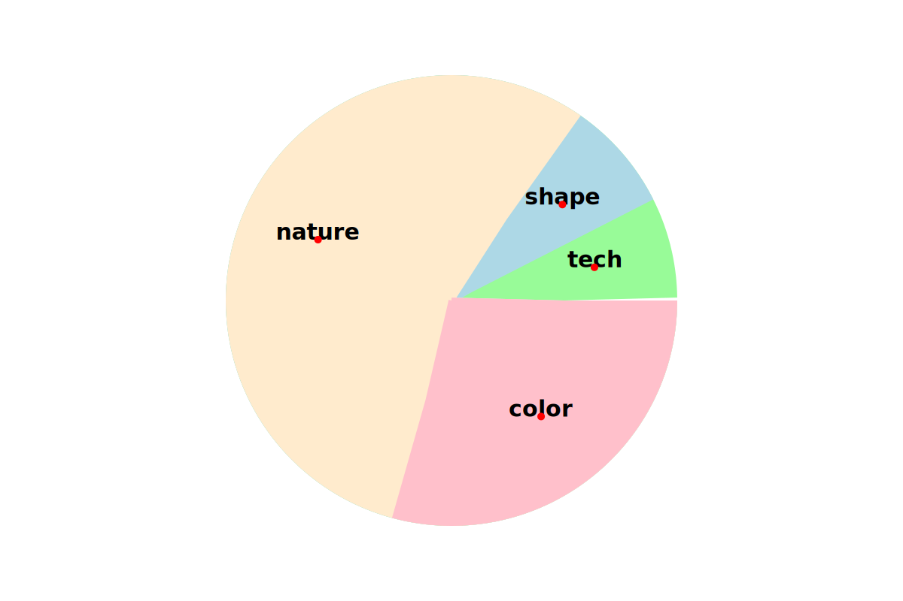
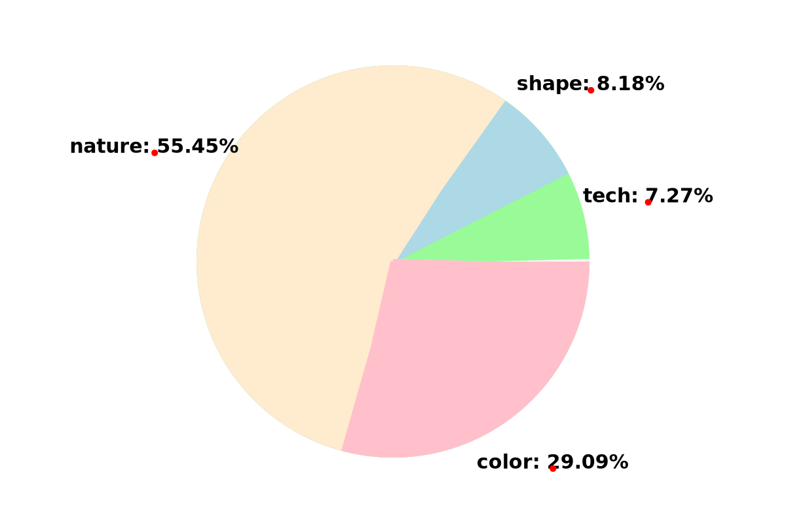

# Creating Pie Chart with Stroke-dasharray

## What is stroke-dasharray?
*Stroke-dasharray* is an attribute to draw dotted lines with custom style. It can include one or more values to define sizes of dashes and gaps.

### Examples
#### Stroke-dasharray in \<line\>
```xml
<!-- stroke-dasharray with one value -->
<svg style="background-color:lightgrey">
    <g transform="translate(20,20)" >   
    
            <line x1="0" y1="0" x2="100" y2="0" stroke="black" 
                  stroke-dasharray="8"/>
                  
    </g>
</svg>
```
Output:

  

If stroke-dasharray has only one value, the sizes of both dashes and gaps are the same, which are 8 here.

Since the size of the line is 100, and 100 is not divisible by 8, we can see that the last dash is partially displayed.

```xml
<!-- stroke-dasharray with two values -->
<line x1="0" y1="0" x2="100" y2="0" stroke="black" 
      stroke-dasharray="15 8"/>                 
```
Output:

 

If stroke-dasharray have two values, then the first one(15) is for size of dashes, while the second one(8) is for that of gaps. 

Still, the part overflow is hidden.

#### Stroke-dasharray in \<circle\>
```xml
   <circle cx="50" cy="50" r="20" stroke="black" stroke-width="3"
           fill="none "stroke-dasharray="15 8"/>
```
Output:

 

Stroke-dasharray in circle is similar with that in line. The size of dashes is 15, while that of gaps is 8. The length of the stroke is circumference of circle. The part of dashes or gaps beyond circumference also is hidden. We can see that two dashes look like connected together. 

## How to draw a pie chart with stroke-dasharray?
### Start with drawing a slice of pie chart
Before solving this problem, we can try to imagine that if a stroke-dasharray attribute with two values has an extremely large sized gap, what would happen?
```
<!-- 9999999 means a very high value here. -->
<circle cx="50" cy="50" r="20" stroke="black" stroke-width="3" 
        fill="none" stroke-dasharray="15 9999999"/>
        
```
Output:

 

We can only get one dash, because the size of gaps is so large that other dashes are hidden. In fact, we do not need an extremely large sized gap. When the size of gaps is greater or equals to the circumference of the circle, any other dash is hidden.

Then, try to increase the width of the stroke. When the width of the stroke is large enough, like twice the radius, we can get a slice. 

 

The dark grey part in the image above is the stroke with stroke-width 3, while the black part is with stroke-width 40. 

We can see that stroke-width expands both inside and outside of the stroke. This is why we need the stroke-width with twice the radius to get a slice.

### How to control the percentage of a slice?
We need two formulas:

- slice = percent * whole

- whole(circle circumference)  = 2 \* π \* radius

Set the size of dashes as value **slice**, and set the size of gaps as value **whole**.

So, we can get:

stroke-dasharray="slice, whole"

stroke-dasharray="2 \* π \* radius \* percent , 2 \* π \* radius"

```xml
<!-- draw a 25% slice -->
<!-- 
     radius = 20
     slice = 2*pi*20*25% = 31.416 
     whole = 2*pi*20 = 125.664
-->
<circle cx="50" cy="50" r="20" stroke="black" stroke-width="40" 
        fill="none" stroke-dasharray="31.416 125.664"/>
        
```
Output:

 

### How to draw the whole pie chart?
This is the data for our pie chart.

| objects     |percentage(%)| color|
| :---------- | :---------: | :---:|
| A           | 30          | red  |
| B           | 10          | blue |
| C           | 60          | green|

Firstly, we need to draw a slice with the sum of percentages of all objects. In this case, we have three objects, so it is A% + B% + C%.
```xml
<!-- 
     radius = 20        
     Slice:
        A% + B% + C% = 100%
        2*pi*20*100% = 125.664 
     Whole:
        2*pi*20 = 125.664
-->
<circle cx="50" cy="50" r="20" stroke="green" stroke-width="40" 
        fill="none" stroke-dasharray="125.664, 125.664"/>
        
```
Output:

 

In each next step, we need to eliminate the last data and calculate the sum of the rest data to draw the each slice.

In this case, we eliminate C%, get the sum of A% and B%, and draw the slice with A%+B% (blue slice). Then, eliminate B%, and draw the slice with A% (red slice).

```xml
<!-- 
     radius = 20
     Slice:
        A% + B% = 40%
        2*pi*20*40% = 50.265 
     Whole:
        2*pi*20 = 125.664
-->
<circle cx="50" cy="50" r="20" stroke="darkblue" stroke-width="40" 
        fill="none" stroke-dasharray="50.265, 125.664"/>
        
```
Output:

 

Since the code is executed line by line, the later slices can cover previous slices. In the image above, the blue slice covers the green one, and now the green one shows the percentage of object C, which is 60%.

When we remain only one object, and we can draw the slice with percentage of it directly. In this case, we draw a slice with A%.
```xml
<!-- 
     radius = 20
     Slice:
        A%= 30%
        2*pi*20*30% = 37.699 
     Whole:
        2*pi*20 = 125.664
-->
<circle cx="50" cy="50" r="20" stroke="darkred" stroke-width="40" 		  
        fill="none" stroke-dasharray="37.699, 125.664"/>

        
```
Output:

 

In the final step, the red slice covers the blue one. Blue slice is 10% now, while red slice is 30%. Thus, we get a whole pie chart.

### In XSLT

In XSLT, we can use math functions, so we are allowed to throw away our calculator.
```xml
<?xml version="1.0" encoding="UTF-8"?>
<xsl:stylesheet xmlns:xsl="http://www.w3.org/1999/XSL/Transform" version="3.0"
    xmlns:xs="http://www.w3.org/2001/XMLSchema"
    xmlns="http://www.w3.org/2000/svg"
    xmlns:math="http://www.w3.org/2005/xpath-functions/math"
    exclude-result-prefixes="xs math">
    
    <xsl:output method="xml" indent="yes"/> 
```
Add this code to xslt element, so that we can work with math:pi().
```xml
    <xsl:variable name="radius" select="20"
    <!-- math:pi() returns the value of pi-->    
    <xsl:variable name="circumf" select="2 * math:pi() * $radius"/>
```

```xml
<!-- This is an example to draw a pie chart in XSLT -->

<!-- Get the total number of all objects -->
<xsl:variable name="total" select="//page/*[not(self::line)][not(self::description)]! name() => count()"/>

<!-- Get the number of each object -->
<xsl:variable name="color" select="//color => count()"/>
<xsl:variable name="nature" select="//nature => count()"/>
<xsl:variable name="shape" select="//shape => count()"/>
<xsl:variable name="tech" select="//tech => count()"/>

<!-- Calculate the percentage for each object -->
<xsl:variable name="colorPercent" select="$color div $total"/>
<xsl:variable name="naturePercent" select="$nature div $total"/>
<xsl:variable name="shapePercent" select="$shape div $total"/>
<xsl:variable name="techPercent" select="$tech div $total"/>

<!-- Draw pie chart -->
<circle fill="none" cx="0" cy="0" r="{$radius}" 
        stroke-width="{$radius * 2}" stroke-dasharray="{$circumf * ($techPercent  + $colorPercent  +  $naturePercent  + $shapePercent), $circumf}" stroke="palegreen"/>
                
<circle fill="none" cx="0" cy="0" r="{$radius}" stroke-width="{$radius * 2}"
        stroke-dasharray="{$circumf *  ($techPercent + $colorPercent + $naturePercent), $circumf}" stroke="lightblue"/>
                
<circle fill="none" cx="0" cy="0" r="{$radius}" stroke-width="{$radius * 2}" 
        stroke-dasharray="{$circumf * ($techPercent + $colorPercent), $circumf}" stroke="blanchedalmond"/>
                
<circle fill="none" cx="0" cy="0" r="{$radius}" stroke-width="{$radius * 2}" 
        stroke-dasharray="{$circumf * $techPercent, $circumf}" stroke="pink"/>
```

Output:

 

[Link to the sample xml file](KewG_p4-12.xml)

[Link to the sample xslt file](KewG_pieChart.xsl)

# Labeling Pie Chart with Polar Coordinates

## Why are polar coordinates?

In svg, we need to use rectangular coordinates (x, y) to plot points. However, after drawing pie chart, we only have percentages for each object and the radius of the pie chart. Polar coordinates refers to (r, θ) instead of (x, y), which allows us label data for pie chart with data of percentages and radius.

Here, we will learn how to plot points on polar coordinates and how to convert polar coordinates to rectangular coordinates.

## How to plot points on polar coordinates?

In polar coordinates, points are plotted by (r, θ).  r is radius, and θ is the angle in radians. 

Below is the polar coordinate plane.

 

Polar coordinate system is a polar grid.

r is the circle, which shows different distances between the circle and origin.

θ is the straight line, which sweeps and grows in the counterclockwise from 3 o'clock. 

### Example

#### Plotting the point(100, 3π/4)

 

The red line is the circle labeled by 100, which means r = 100, and the blue one shows the direction of 3π/4, which means θ = 3π/4. The point plotted at the intersection of the red and blue lines is (100, 3π/4).

## How to convert polar coordinates to rectangular coordinates?

We need two formulas:

* x = r\*cosθ
* y = r\*sinθ 

### Example

#### Convert the point(100, 3π/4)

It should be noted that svg flips Y axis, so when we plot points with these formulas in svg coordinate system, we need to toggle the sign of  y-coordinate.

```xml
<g transform="translate(300,300)" fill="black">
        <!-- 
            cx = rcosθ = 100 * cos(3π/4) = -70.71 
            cy = rsinθ = 100 * sin(3π/4) = 70.71
			Toggle the sign of cy, so it should be -70.71.
        -->
        <circle r="5" cx="-70.71" cy="-70.71" stroke-width="5"/>
</g>
```

Output:

 

If you want to test this code, you can download [this svg file](polarImages/plane_convert.svg). The code of polar grid is a little bit long, so not show in this tutorial.

## How to set labels with polar coordinates in xslt?

As the mentioned above, we need to get r and θ for each label of objects in polar coordinates.

### How to get r?

r here means the radius for label position in polar coordinate. Since the size of the pie chart in this tutorial refers to the stroke-width, the real radius of the pie chart is twice radius that we declared for \<circle> (We declare radius as 200 units for \<circle>, but the real radius of the pie chart is 400 units.). For convenience, we can consider to set the r for labels in polar coordinates as twice radius that we declared for \<circle> temporarily.

```xml
<!-- $raduis controls the size of the pie chart -->
<xsl:variable name="labelRadius" select="2*$radius"/>
```

### How to get θ?

Now, we should have got data of percentages for each object. Thus, we can get θ (angle in radians) for each object.

For convert percentage to angle in radians, we need these formulas:

* radians = π/180

* angle = percent \* 360°

* angle in radians = angle * radians

After simplifying, we get:

* radians = π/180

* angle in radians =  percent \* 360 * radians

```xml
<!-- Convert percentage to angle in radians -->
<!-- radians = π/180 -->
<xsl:variable name="radians" select="math:pi() div 180"/>
<!-- angle in radians =  percent * 360 * radians -->
<xsl:variable name="colorRadians" select="$colorPercent * 360 * $radians"/>
<xsl:variable name="natureRadians" select="$naturePercent * 360 * $radians"/>
<xsl:variable name="shapeRadians" select="$shapePercent * 360 * $radians"/>
<xsl:variable name="techRadians" select="$techPercent * 360 * $radians"/>
```

If we convert to rectangular coordinates with these θs, we can get:

 

It works, but not ideal. We perhaps prefer to set the label in the middle of the arc for each slice.

```xml
<!-- the mid of the arc in polar coordination -->
<xsl:variable name="colorRadiansMid" select="$colorRadians div 2"/>
<xsl:variable name="natureRadiansMid" select="$colorRadians+$natureRadians div 2"/>
<xsl:variable name="shapeRadiansMid" select="$colorRadians+$natureRadians+$shapeRadians div 2"/>
<xsl:variable name="techRadiansMid" select="$colorRadians+$natureRadians+$shapeRadians+$techRadians div 2"/>

<!-- the mid of the arc in rectangular coordination -->
<xsl:variable name="colorMidX" select="2*$radius* math:cos($colorRadiansMid)"/>
<xsl:variable name="colorMidY" select="2*$radius* math:sin($colorRadiansMid)"/>
<xsl:variable name="natureMidX" select="2*$radius* math:cos($natureRadiansMid)"/>
<xsl:variable name="natureMidY" select="2*$radius* math:sin($natureRadiansMid)"/>
<xsl:variable name="shapeMidX" select="2*$radius* math:cos($shapeRadiansMid)"/>
<xsl:variable name="shapeMidY" select="2*$radius* math:sin($shapeRadiansMid)"/>
<xsl:variable name="techMidX" select="2*$radius* math:cos($techRadiansMid)"/>
<xsl:variable name="techMidY" select="2*$radius* math:sin($techRadiansMid)"/>
```

If we convert to rectangular coordinates with these middle values, we can get:

 

Now we can try to decrease the radius for labels like this:

```xml
<xsl:variable name="labelRadius" select="1.3*$radius"/>
```

Then, you can get:

 

This way to label suits to short labels and wide pie wedges. If we want to set long labels or set labels for narrow pie wedges, we can move labels outside of pie chart and use label lines.

## How to set long labels for pie chart?

For setting long labels, we can use label lines, and for setting label lines, we need to move labels outside of the pie chart, so we increase radius for labels:

```xml
<xsl:variable name="labelRadius" select="2*$radius + 100"/>
```

We get:

 

Set text anchor for all labels. If the label is on the left of center of pie chart, its text anchor is end. Otherwise it is start.

```xml
<!-- Set the text anchor for labels -->
<!-- $cx is the x-coordinates of the center of the pie chart -->
<xsl:variable name="cx" select="0"/>
<xsl:variable name="colorTextAnchor">
	<xsl:choose>
   		<xsl:when test="$colorX &lt; $cx">end</xsl:when> 
		<xsl:otherwise>start</xsl:otherwise>
	</xsl:choose>     
</xsl:variable>

<!-- The font anchor for other labels are handled as above -->
```

So, we can get:

 

Now we can set any type of label lines as we like. 

We can just connect the point of label and the mid of its arc.

```xml
<!-- label lines -->
<!-- $colorX and $colorY are the position of color label (the red point beside color label).
	 $colorMidX and $colorMidY is the mid of arc for color slice (the blue point on the pink shell).
	 ......
-->
<g transform="translate(500, 500)" stroke="grey" stroke-width="3" fill="none"> 
    <line x1="{$colorX}" y1="{$colorY}" x2="{$colorMidX}" y2="{$colorMidY}"/>
    <line x1="{$natureX}" y1="{$natureY}" x2="{$natureMidX}" y2="{$natureMidY}"/>
    <line x1="{$shapeX}" y1="{$shapeY}" x2="{$shapeMidX}" y2="{$shapeMidY}"/>
    <line x1="{$techX}" y1="{$techY}" x2="{$techMidX}" y2="{$techMidY}"/>
</g>
```

Output:

 

In the sample file, I use path to draw the label lines and add a small circle for decoration. The label line connects the the mid point of arc, a point (mid of arc +/- 10, height of label), and a point beside the label.

```xml
<!-- Set the direction for label lines -->

<!-- The value of line can be any ingeter, it mainly helps to record the direction of label lines growing. -->
<xsl:variable name="line" select="10"/>
<!-- If the label is on the left of the center of pie chart, its sign is negative. Otherwise, it is positive -->
<!-- $cx is the x-coordinates of the center of the pie chart -->
<xsl:variable name="colorLine">
    <xsl:choose>
        <xsl:when test="$colorX &lt; $cx"> 
        	-<xsl:value-of select="$line"/>
        </xsl:when> 
        <xsl:otherwise>
            +<xsl:value-of select="$line"/>
        </xsl:otherwise>
    </xsl:choose>     
</xsl:variable>

<!-- The direction of label line for the rest labels are handled as above -->


<!-- This font-size variable is used to locate the mid point of height of the font -->
<xsl:variable name="font-size" select="30"/>

<!-- label lines -->
<g transform="translate(500, 500)" stroke="grey" stroke-width="3" fill="none">   
    <path d="M{$colorMidX} {$colorMidY} L{$colorMidX+$colorLine} {$colorY+10 -$font-size div 2} H{$colorX -$colorLine}"/>
    <circle cx="{$colorX -$colorLine}" cy="{$colorY+10 -$font-size div 2}" r="4" fill="grey"/>
    
    <path d="M{$natureMidX} {$natureMidY} L{$natureMidX+$natureLine} {$natureY+10 -$font-size div 2} H{$natureX -$natureLine}"/>
    <circle cx="{$natureX -$natureLine}" cy="{$natureY+10 -$font-size div 2}" r="4" fill="grey"/>
    
    <path d="M{$shapeMidX} {$shapeMidY} L{$shapeMidX+$shapeLine} {$shapeY+10 -$font-size div 2} H{$shapeX -$shapeLine}"/>
    <circle cx="{$shapeX -$shapeLine}" cy="{$shapeY+10 -$font-size div 2}" r="4" fill="grey"/>
    
    <path d="M{$techMidX} {$techMidY} L{$techMidX+$techLine} {$techY+10 -$font-size div 2} H{$techX -$techLine}"/>
    <circle cx="{$techX -$techLine}" cy="{$techY+10 -$font-size div 2}" r="4" fill="grey"/>
</g>

```

Output:

 

The way to label suits to both long or short labels and wide or narrow pie wedges, because we can increase the radius for labels to gain more space. However, this way needs more patience, so it is not suitable for pie charts with too many objects.

[Link to the sample xml file](KewG_p4-12.xml) (This xml file is the same as the one above.)

[Link to xslt file for labeling pie chart](KewG_polar.xsl)
